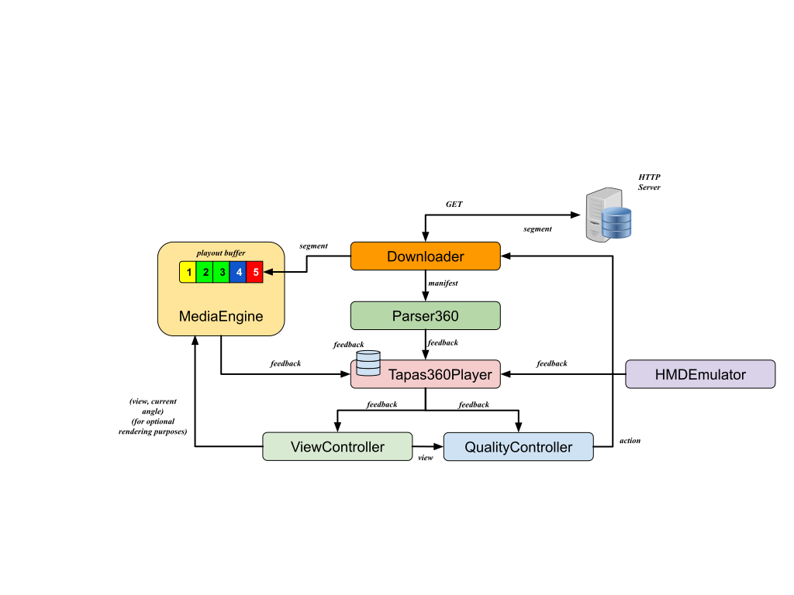

.. TAPAS-360° documentation master file, created by Vito Caldaralo
   sphinx-quickstart on Tue Sep  9 11:39:28 2014.
   You can adapt this file completely to your liking, but it should at least
   contain the root `toctree` directive.

TAPAS-360° documentation - Tool for rApid Prototyping of Adaptive Streaming algorithms
======================================================================================

TAPAS-360° is an open-source Tool for rApid Prototyping of Adaptive Streaming control algorithms. It is a flexible and extensible video streaming client written in Python that allows rapid prototyping both for the classic Adaptive Streaming algorithms - used in the HLS and DASH-compliant video streaming platforms - and of the new Viewport Adaptivity algorithms, proposed for the distribution of panoramic content compliant with the MPEG-DASH SRD specifications. In this way, researchers can easily design and carry out experimental performance evaluations without needing to write the code to download video segments, parse manifest files, and decode the video stream.
TAPAS-360° has been designed to minimize the CPU and memory footprint so that experiments involving a large number of concurrent video flows can carried out using a single client machine.
The instrument was designed to make the modules independent in order to guarantee extreme flexibility and rapid prototyping. In this way, new control logics can be implemented by extending and implementing the functions in the appropriate module without the need to modify the entire tool.

Architecture
------------

TAPAS-360° is implemented by aggregation of different interacting components: 
	1) the `Parser`_, that parses the video manifest file; 
	2) the `MediaEngine`_ that stores the downloaded video in the playout buffer and plays the video; 
	3) the `QualityController`_ that selects the video level of the next segment to be downloaded; 
	4) the `ViewController`_ that selects the most suitable viewpoint representation to be download; 
	5) the `HMDEmulator`_ that emulates the exploration of the immersive content; 
Each of these three components can be extended individually by inheriting the corresponding base class. Moreover, it is worth to mention that `Tapas360Player`_ includes an extensible module that periodically logs in a file the variables of interest.

.. _Tapas360Player: tapasPlayer.html
.. _Parser: parser.html
.. _MediaEngine: mediaEngine.html
.. _QualityController: controller.html
.. _ViewController: viewController.html
.. _HMDEmulator: hmdEmulator.html

.. code-block:: python
   :linenos:

   c = Controller(ctrl_options)
   p = Parser(url_playlist)
   m = MediaEngine(media_options)
   player = TapasPlayer(controller=c, parser=p, media=m, other_options)
   player.play()

.. toctree::
   :maxdepth: 1

   tapasPlayer
   parser
   mediaEngine
   controller
   viewController
   hmdEmulator

Usage
-----

Play a default playlist: ::
    
    $ python3 play.py

Play a default playlist with a "conventional" adaptive controller: ::
    
    $ python3 play.py --controller conventional
    
Play a playlist specified by its URL: ::

    $ python3 play.py --url http://mysite.com/myplaylist.m3u8

Play a sample MPEG-DASH video: ::
    
    $ python3 play.py --url http://yt-dash-mse-test.commondatastorage.googleapis.com/media/car-20120827-manifest.mpd

Play an omnidirectional content: ::
    
    $ python3 play.py --vr True 

Play an omnidirectional content using the provided "conventional" viewport adaptive strategy (the specific --url is to be provided) : ::
    
    $ python3 play.py --vr True --view_controller conventional --url [URL_PLAYLIST]

Play a playlist for logs, without decoding video: ::

	$ python3 play.py --media_engine nodec

Play a playlist with a fake player (emulated playout buffer and no decoding): ::

	$ python3 play.py --media_engine fake

Play only the highest quality of the playlist: ::

	$ python3 play.py --controller max

Player options: ::

	$ python3 play.py --help

Enable debug: ::
    
    $ DEBUG=2 python3 play.py

Indices and tables
==================

* :ref:`genindex`
* :ref:`modindex`
* :ref:`search`

